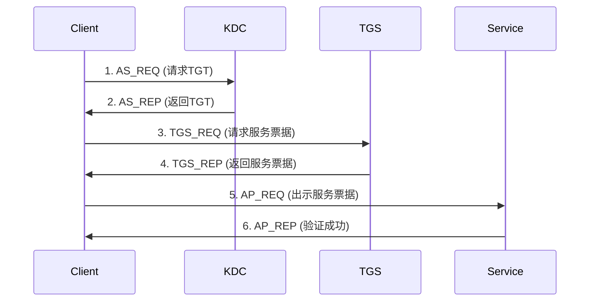

# 域

## 1. 域的基本概念

### 1.1 定义

**域** 是一个逻辑的安全边界，包含一组共享同一Active Directory数据库的计算机、用户和资源，通过域控制器进行集中管理。

### 1.2 核心特征

* **集中管理** ：统一管理用户、计算机和策略
* **单点登录** ：一次认证访问所有授权资源
* **安全边界** ：独立的安全策略和身份验证
* **层次结构** ：采用树状组织结构

## 2. 域的核心功能

### 2.1 集中身份管理

**powershell**

```
# 统一用户账户管理
- 创建/删除用户账户
- 密码策略强制执行
- 账户锁定策略
- 用户属性管理
```

### 2.2 统一资源管理

**powershell**

```
# 资源集中控制
- 文件共享权限
- 打印机管理
- 应用程序部署
- 系统配置管理
```

### 2.3 策略统一实施

**powershell**

```
# 组策略功能
- 安全策略配置
- 软件分发管理
- 桌面环境控制
- 脚本执行管理
```

## 3. 域的组成架构

### 3.1 逻辑组件

**text**

```
林 (Forest)
  ↓
树 (Tree) 
  ↓
域 (Domain)
  ↓
组织单位 (OU)
  ↓
对象 (用户、计算机、组)
```

### 3.2 物理组件

**powershell**

```
# 关键组件
- 域控制器 (Domain Controller)
- Active Directory 数据库 (ntds.dit)
- 全局编录 (Global Catalog)
- DNS 服务器
- 站点 (Sites) 和子网
```

## 4. 域控制器详解

### 4.1 域控制器功能

**powershell**

```
# 主要功能
- 身份验证服务
- 目录服务存储
- 策略应用
- 目录复制
```

### 4.2 FSMO 角色

**powershell**

```
# 五种操作主机角色
- 架构主机 (Schema Master)
- 域命名主机 (Domain Naming Master) 
- PDC 仿真器 (PDC Emulator)
- RID 主机 (RID Master)
- 基础结构主机 (Infrastructure Master)

# 查询FSMO角色
netdom query fsmo
Get-ADForest | Select-Object SchemaMaster,DomainNamingMaster
Get-ADDomain | Select-Object PDCEmulator,RIDMaster,InfrastructureMaster
```

### 4.3 域控制器部署

**powershell**

```
# 安装域控制器
Install-WindowsFeature -Name AD-Domain-Services -IncludeManagementTools
Install-ADDSForest -DomainName "company.com" -DomainNetbiosName "COMPANY" -InstallDNS
```

## 5. 认证流程详解



### 5.1 Kerberos认证流程

### 5.2 详细步骤说明

**powershell**

```
# 步骤1: 用户登录工作站
# 步骤2: 工作站向KDC的AS请求TGT
# 步骤3: AS验证用户身份，返回加密的TGT
# 步骤4: 工作站使用TGT向TGS请求访问特定服务的票据
# 步骤5: TGS验证TGT，返回服务票据
# 步骤6: 工作站向目标服务出示服务票据
# 步骤7: 服务验证票据，授权访问
```

### 5.3 NTLM认证流程

**powershell**

```
# 用于不支持Kerberos的场景
1. 协商 (Negotiate)
2. 挑战 (Challenge) 
3. 响应 (Response)
```

## 6. 关键协议详解

### 6.1 LDAP协议

**powershell**

```
# 轻量级目录访问协议
- 端口: 389 (LDAP), 636 (LDAPS)
- 用途: 目录信息查询和修改
- 操作: 搜索、添加、修改、删除目录对象

# LDAP查询示例
Get-ADUser -Filter "Name -like 'John*'" -Properties DisplayName,Department
```

### 6.2 Kerberos协议

**powershell**

```
# 网络认证协议
- 端口: 88 (TCP/UDP)
- 特点: 双向认证、票据机制
- 优势: 防止重放攻击、支持委托
```

### 6.3 DNS协议

**powershell**

```
# 域名解析服务
- 端口: 53 (TCP/UDP)
- SRV记录: 定位域服务(_ldap._tcp.dc._msdcs)
- 动态更新: 客户端自动注册DNS记录
```

### 6.4 SMB协议

**powershell**

```
# 服务器消息块
- 端口: 445 (TCP)
- 用途: 文件共享、打印机共享
- 特性: 支持签名、加密
```

## 7. 服务发现机制

### 7.1 DNS SRV记录发现

**powershell**

```
# 查询域控制器
nslookup -type=SRV _ldap._tcp.dc._msdcs.company.com

# 关键SRV记录
- _ldap._tcp.dc._msdcs.<Domain>     # 域控制器
- _kerberos._tcp.dc._msdcs.<Domain> # Kerberos服务
- _ldap._tcp.pdc._msdcs.<Domain>    # PDC仿真器
- _ldap._tcp.gc._msdcs.<Forest>     # 全局编录
```

### 7.2 站点感知服务发现

**powershell**

```
# 客户端自动定位最近域控制器
- 基于客户端IP和站点配置
- 减少跨WAN认证延迟
- 自动故障转移

# 测试域控制器定位
nltest /dsgetdc:company.com
Test-ComputerSecureChannel -Server "DC01.company.com"
```

## 8. 资源访问方式

### 8.1 认证资源访问

**powershell**

```
# 单点登录访问流程
1. 用户登录域账户
2. 获取Kerberos票据
3. 访问共享资源: \\server\share
4. 自动身份验证
5. 基于权限授权访问
```

### 8.2 共享资源访问控制

**powershell**

```
# 共享权限 + NTFS权限组合
最终权限 = min(共享权限, NTFS权限)

# 查看共享权限
Get-SmbShareAccess -Name "DataShare"

# 查看NTFS权限
(Get-Acl "C:\Data").Access | Format-Table IdentityReference,FileSystemRights,AccessControlType
```

## 9. 权限控制体系

### 9.1 基于角色的访问控制

**powershell**

```
# 用户权限组成
用户有效权限 = 用户直接权限 + 组权限 - 显式拒绝

# 权限继承
- 父容器权限继承到子对象
- 可阻断继承应用独特权限
```

### 9.2 组策略权限管理

**powershell**

```
# 安全策略应用
- 密码策略
- 账户锁定策略
- 用户权限分配
- 安全选项配置
- 软件限制策略
```

### 9.3 委派管理模型

**powershell**

```
# 管理权限委派
- OU级别管理委派
- 特定任务委派
- 基于组的权限分配

# 委派示例：重置密码权限
Delegate-ADPermission -Identity "OU=Sales,DC=company,DC=com" -User "SalesAdmins" -Access Rights "ResetPassword"
```

## 10. 安全特性

### 10.1 身份验证安全

**powershell**

```
# 多因素认证支持
- 智能卡认证
- 证书认证
- 生物识别集成

# 认证策略
- 密码复杂度要求
- 账户锁定阈值
- 登录时间限制
```

### 10.2 审计和监控

**powershell**

```
# 关键安全事件监控
- 账户登录/注销
- 目录服务访问
- 策略更改
- 特权使用

# 启用详细审计
Auditpol /set /category:"DS Access" /success:enable
```

## 11. 高可用和灾难恢复

### 11.1 多域控制器架构

**powershell**

```
# 冗余设计
- 多DC负载均衡
- 自动故障转移
- 站点间复制

# 复制监控
repadmin /replsummary
Get-ADReplicationFailure -Target "DC02"
```

### 11.2 备份和恢复策略

**powershell**

```
# 系统状态备份
wbadmin start systemstatebackup -backupTarget:D:

# 权威还原
ntdsutil "ac i ntds" "auth restore" "restore object CN=user,OU=Sales,DC=company,DC=com"
```

## 12. 总结

域环境提供了企业级的集中管理和安全控制能力，主要特点包括：

* **集中管理** ：通过Active Directory统一管理
* **安全认证** ：Kerberos协议确保身份安全
* **服务发现** ：DNS SRV记录自动定位服务
* **权限控制** ：基于角色的精细权限管理
* **高可用性** ：多域控制器冗余设计
